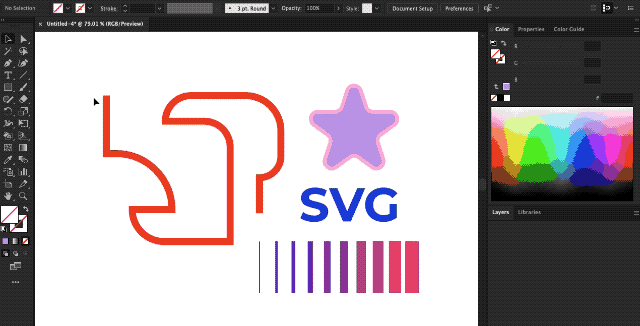
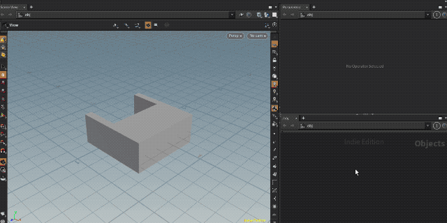
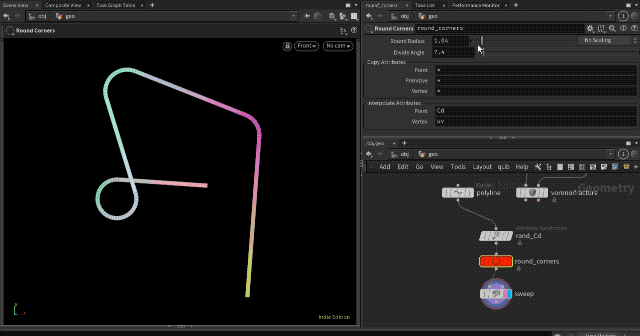
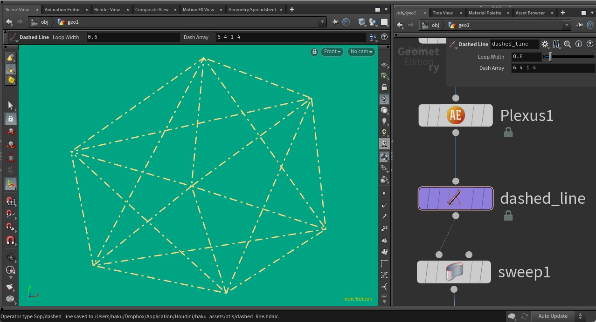

# Non-Procedural Houdini Assets

Digital Assets created by [Baku Hashimoto](https://baku89.com) to summplement the lack of 'destructive editing' features of Houdini.

Most of these assets are intended to be an quick way to manually edit attributes, splines, a group of packed geometries in a destructive manner. All of HDA works above H18.

**Note:** I strongly recommend not to use these for any production purpose. These assets are still working-in-progress and some bugs and incompatible updates might break your projects. Please use them only for evaluation.

## Nodes

### Draw Bezier SOP

Draw bezier curves in a conventional way of other standard grahic tools.


<!--
### Draw Polyline SOP

Similar to Draw Bezier SOP but only can draw polylines. Instead, the SOP can draw over and modify the input polylines and also allows multiple vertices per point. (This is especially buggy)
-->

### Parse SVG SOP

You can copy & paste a svg code from Adobe Illustrator while preserving the style attributes.
Paths with neither stroke nor fill will be ignored.



#### Limitations

The SOP works fine for SVG code generated and stored into the clipboard when you copy items in Illustrator. Paths with neither fill and stroke will be ignored. Some of path commands, styles, and symbols are not yet supported. For example:

- `A` (arc) command in `d` attributes of `<path>` tag
- Symbols definition in `<def>`
- Inline styles in path (e.g. `fill` `stroke` `style` attributes in path tags)

### Wrap SVG SOP

Parse SOP with UV-based projection feature onto the surface. It would be useful in the case you want to add some details to a model. Please keep in mind that paths crossing over UV islands will be broken.



### Round Corners SOP

Makes all corners of polyline rounded.



### Transform Packed SOP

Edit transformation of series of packed geometries at once.


### Attribute Manual SOP

Manually assigns attribute values to specific elements.


### Dashed Line

Converts a polyline to dashed stroke by specifying SVG's stroke-dasharray



### Attribute Normalize SOP

Normalizes an attribute of input between specific range automatically.

### Export AE Keyframes OBJ

Copy the keyframe data of transformation of OBJ node or camera so that user can paste it to After Effects.


### Bang

Creates a detail attribute which turns 1 on every frame you press the Bang button. It also has attack/decay options and therefore you can quickly make pulse or heartbeart animation by hand.


## Quick Installation

1. Download the latest version from [this repository](https://github.com/baku89/baku-hda/archive/main.zip).
1. Append the path to the downloaded folder to the \$HOUDINI_PATH by either way:

   - Append `HOUDINI_PATH = "$HOUDINI_PATH;PATH_TO_THE_DIR;&"` to your houdini.env. (On Linux and macOS, use `:` instead of `;`)
   - Append below snippets to your [Houdini packages](https://www.sidefx.com/docs/houdini/ref/plugins.html)

```
{
	"env": [
		{ "HOUDINI_PATH": ["PATH_TO_THE_DIR"] }
	]
}
```
